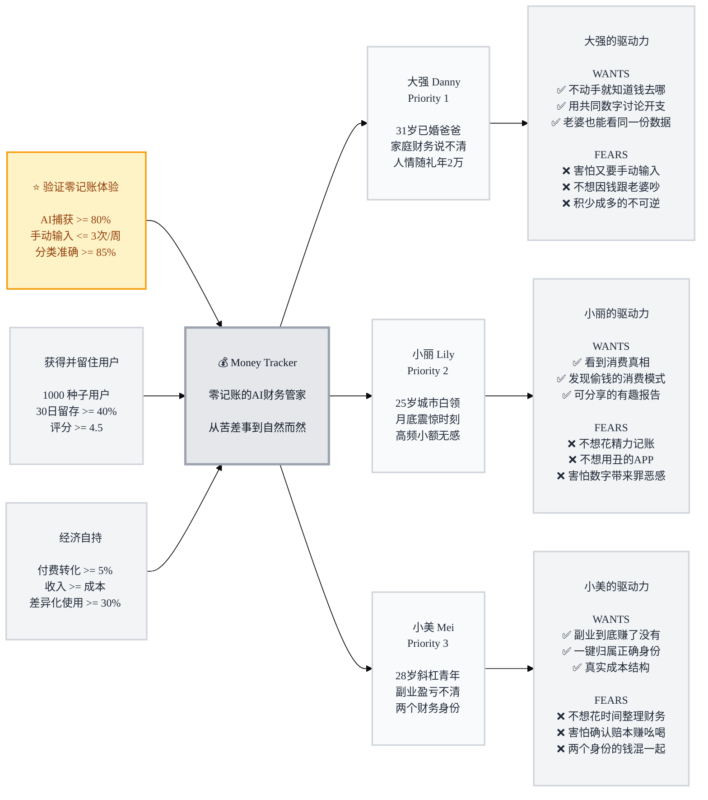

# Trigger Map: Money Tracker

> 将商业目标连接到用户心理的战略总览

**Created:** 2026-04-09
**Author:** Sue
**Methodology:** Based on Effect Mapping (Balic & Domingues), adapted for WDS framework
**Mode:** Suggest

---

## Strategic Documents

This is the visual overview. For detailed documentation, see:

- **[01-Business-Goals.md](01-Business-Goals.md)** - 愿景、SMART目标、飞轮逻辑
- **[02-Danny.md](02-Danny.md)** - Primary: 大强 -- 已婚家庭，家庭财务管理
- **[03-Lily.md](03-Lily.md)** - Secondary: 小丽 -- 城市白领，消费感知
- **[04-Mei.md](04-Mei.md)** - Tertiary: 小美 -- 斜杠青年，多身份核算
- **[05-Key-Insights.md](05-Key-Insights.md)** - 战略洞察、设计原则、开发阶段

---

## Vision

**让中国用户告别"记账"这个动作 -- 通过AI自动捕获和智能管理，把财务清晰从"苦差事"变成"自然而然"。**

---

## Business Objectives

### Objective 1: 验证零记账体验 (THE ENGINE)
- **Metric:** AI捕获覆盖率 Android >= 80%, iOS >= 60%
- **Target:** 用户每周手动输入 <= 3次
- **Timeline:** MVP后3个月

### Objective 2: 获得并留住用户 (GROWTH)
- **Metric:** 1000注册用户，30日留存 >= 40%，评分 >= 4.5
- **Timeline:** 上线后6个月

### Objective 3: 经济自持 (SUSTAINABILITY)
- **Metric:** 付费转化 >= 5%，收入 >= 运营成本
- **Timeline:** 上线后12个月

---

## Target Groups (Prioritized)

### 1. Danny the Debt-Dodging Dad (大强) -- Primary

**Priority Reasoning:** 同时服务全部三个商业目标。家庭场景验证零记账、高留存（迁移成本高）、三个付费功能精准命中。

> 31岁已婚爸爸，月供6500，家庭月入2万但说不清钱去哪了。试过记账APP坚持两周放弃。人情随礼年支出近2万。核心矛盾不是谁花多了，而是跟老婆没有共同的"事实"。

**Key Positive Drivers:**
- 不动手就知道钱去哪了（15/15）
- 用共同数字讨论家庭开支（14/15）
- 让老婆也能看到同一份数据（13/15）

**Key Negative Drivers:**
- 害怕又要手动输入（14/15）
- 不想再因为钱跟老婆吵（13/15）
- 害怕积少成多的不可逆（12/15）

### 2. Lily the Latte-Loving Lady (小丽) -- Secondary

**Priority Reasoning:** 最大用户基数，获取成本低（社交传播），"月底震惊"是最强自然获客时刻。

> 25岁一线城市运营，月薪12000，高频小额无感消费。不知道钱怎么没的，需要一面消费真相的镜子。试过记账觉得"比花钱还累"。

**Key Positive Drivers:**
- 看到消费真相（14/15）
- 发现偷走钱的消费模式（13/15）
- 可分享的有趣消费报告（11/15）

**Key Negative Drivers:**
- 不想花任何精力记账（15/15）
- 不想用丑的APP（13/15）
- 害怕数字带来罪恶感（10/15）

### 3. Mei the Micro-Business Maven (小美) -- Tertiary

**Priority Reasoning:** 最高付费意愿。多身份核算是纯生产力工具，值得付费。

> 28岁斜杠青年，白天设计晚上带货。副业月入波动3000-15000，但不知道扣掉隐性成本后到底赚了没有。需要分清两个"自己"的账。

**Key Positive Drivers:**
- 清楚副业到底赚了还是亏了（14/15）
- 一键归属消费到正确身份（14/15）
- 看到副业真实成本结构（11/15）

**Key Negative Drivers:**
- 不想花时间在财务整理上（13/15）
- 害怕确认赔本赚吆喝（11/15）
- 不想两个身份的钱混一起（11/15）

---

## Trigger Map Visualization

---

## How to Read This Map

**Left to Right Flow:**
1. **Business Goals** (left) -- 我们要实现什么
2. **Platform** (center) -- 我们的产品
3. **Target Groups** (middle) -- 我们为谁做
4. **Driving Forces** (right) -- 他们为什么会用

**Priority System:**
- ⭐ PRIMARY GOAL = THE ENGINE (金色高亮)
- 👥 Priority 1 persona = Design for this person first
- 👤 Priority 2-3 personas = Ensure compatibility

**Driving Forces:**
- ✅ Wants = 正面驱动力（拉力）
- ❌ Fears = 负面驱动力（推力）
- 两者同等重要：Wants设计目标，Fears设计底线

---

## Design Focus Statement

Money Tracker 的设计核心是**把财务真相变成零负担的自然体验**。

**Primary Design Target:** 大强 Danny

**Must Address:**
- 零输入零精力（大强15 + 小丽15 + 小美13 = 三人共识）
- 自动消费真相（大强14 + 小丽14 + 小美14 = 三人共识）
- 共同事实基础（大强14 = 核心差异化）

**Should Address:**
- 年轻化UI（小丽13）
- 消费模式发现（小丽13 + 小美11）
- 数据安全感知（大强11）

---

## Cross-Group Patterns

### Shared Drivers
- **零输入** -- 三人共识最强的驱动力，是产品的身份而非功能
- **真相渴望** -- 都想看到真实数字，但"真相"含义不同（家庭/消费/副业）
- **拒绝审判** -- 都不想被APP教育或产生负面情绪
- **数据安全** -- 都有隐私顾虑，程度不同

### Unique Drivers
- **大强独有：** 夫妻共享、人情管理 -- 关系型需求
- **小丽独有：** 社交分享、审美要求 -- 体验型需求
- **小美独有：** 身份归属、利润计算 -- 生产力型需求

### Potential Tensions
- **简洁 vs 功能深度：** 小丽要极简，小美要多身份核算。解法：分层设计，基础极简 + 高级功能按需展开
- **正向情绪 vs 真相展示：** 小丽怕罪恶感，小美要残酷的真实数字。解法：默认正向表达，提供"详细视图"切换

---

## Next Steps

This Trigger Map feeds into:
- **Phase 3: UX Scenarios** -- 基于persona和驱动力设计用户场景
- **Feature Prioritization** -- 驱动力分数指导功能优先级
- **Content Strategy** -- 正面/负面驱动力指导营销话术

---

_Generated with Whiteport Design Studio framework_
_Trigger Mapping methodology credits: Effect Mapping by Mijo Balic & Ingrid Domingues (inUse), adapted with negative driving forces_
